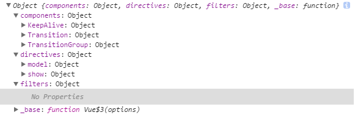

# Vue 源码剖析 v2.5.13

写一个简单的例子，打断点开始跟踪
```html
<div id="app">
    {{msg}}
  </div>
  <script>
    new Vue({
      el:'#app',
      data:{
        'msg':'hello!'
      }
    })
  </script>
```
Vue$3() --> _init() --> initMixin() --> mergeOptions(resolveConstructorOptions(vm.constructor), options, vm) [最后返回二次处理后的 options; 执行过程：合并前2个参数--> mergeField(key) --> strats[key] --> mergeAssets(parentVal,childVal)]
 --> initLifecycle(vm) --> initEvents(vm) --> initRender(vm) -- callHook(vm, 'beforeCreate') --> initInjections(vm) --> initState(vm) --> initProvide(vm) --> callHook(vm, 'created') --> vm.$mount()

## 初始化函数

html代码中，包含2大部分，挂载DOM节点，以及初始化vue的js代码。

注意点：
- el不能挂载到html或者body标签上
```js
// Line 10718
 /* istanbul ignore if */
  if (el === document.body || el === document.documentElement) {
    "development" !== 'production' && warn(
      "Do not mount Vue to <html> or <body> - mount to normal elements instead."
    );
    return this
  }

```
- 关于代码各处可见的"development" !== 'production'
    这个是dev模式才有，vue.js文件中对所有警告的代码判断条件进行了替换，报错方便调试，在发布模式中会自动清除，方便开发。

Vue 最终返回的是Vue$3

```js
(function (global, factory) {
    typeof exports === 'object' && typeof module !== 'undefined' ? module.exports = factory() :
    typeof define === 'function' && define.amd ? define(factory) :
    (global.Vue = factory());
}(this, (function () { 'use strict';

//...
return Vue$3;
})));
```
global在浏览器环境中相当于window，由于有时会在node、webpack等环境中运行，所以需要进行兼容处理，于是有很长的typeof。

对于浏览器来讲，上述代码其实就是window.Vue = Vue$3({options})，所以这就很明了了。

框架起步流程，首先通过一个init函数进行全局初始化

```js
// Line 4640
// 此案例 options = {el:'#app', data:{msg:'hello!'}}
function Vue$3 (options) {
  if ("development" !== 'production' &&
    !(this instanceof Vue$3)
  ) {
    warn('Vue is a constructor and should be called with the `new` keyword');
  }
  this._init(options);
}
```

这里的options参数，很明显就是我们在new对象的时候传进去的对象，目前只有el和data两个。

入口函数只是简单的判断了一下有没有new，然后自动调用了原型函数_init。

_init函数定义在initMixin函数内部，然后在后面调用了这个函数。

```js
// Line 4505
function initMixin (Vue) {
  Vue.prototype._init = function (options) {
    // ...
  };
}

// ...
// Line 4679
initMixin(Vue$3)
```
看看初始化函数里面都干了啥事。
```js
    var vm = this;
    // 全局记数 表示有几个vue实例
    vm._uid = uid$1++; 

    var startTag, endTag;
    // 这里的config.performance开发版默认是false
    if ("development" !== 'production' && config.performance && mark) {
      startTag = "vue-perf-start:" + (vm._uid);
      endTag = "vue-perf-end:" + (vm._uid);
      mark(startTag);
    }

    // 表示是vue实例 避免被observe
    vm._isVue = true;
    // 合并参数
    if (options && options._isComponent) {
      // 优化内部组件实例化
      initInternalComponent(vm, options);
    } else {
      // 正常实例初始化
      // 在这里对参数进行二次加工
      vm.$options = mergeOptions(
        resolveConstructorOptions(vm.constructor),
        options || {},
        vm
      );
    }
    /* istanbul ignore else */
    {
      initProxy(vm);
    }
    // 属性对自身的引用
    vm._self = vm;
    initLifecycle(vm);
    initEvents(vm);
    initRender(vm);
    callHook(vm, 'beforeCreate');
    initInjections(vm); // resolve injections before data/props
    initState(vm);
    initProvide(vm); // resolve provide after data/props
    callHook(vm, 'created');

    /* istanbul ignore if */
    if ("development" !== 'production' && config.performance && mark) {
      vm._name = formatComponentName(vm, false);
      mark(endTag);
      measure(("vue " + (vm._name) + " init"), startTag, endTag);
    }

    if (vm.$options.el) {
      vm.$mount(vm.$options.el);
    }
```

第一步直接可以走到mergeOptions这里，从名字就可以看出这是一个参数合并的函数，接受3个参数：
1. resolveConstructorOptions(vm.constructor) 
```js
// Line 4583
function resolveConstructorOptions (Ctor) {
    //options为所有vue实例基础参数
    // 包含components,directives,filters,_base
  var options = Ctor.options;
  // 这个属性比较麻烦 暂时不考虑 跳过
  if (Ctor.super) {
    // ...
  }
  // 返回修正后的options
  return options
}
```
如果忽略那个super属性的话，返回的其实就是Vue$3.constructor.options，该对象包含4个属性，如图所示。


```js
// Line 4978
// Vue函数自身的引用
Vue.options._base = Vue;

// Line 8026
// 组件相关
var platformDirectives = {
  model: directive,
  show: show
};

// Line 8389
// 相关指令方法
var platformComponents = {
  Transition: Transition,
  TransitionGroup: TransitionGroup
};
// Line 8043
// install platform runtime directives & components
extend(Vue$3.options.directives, platformDirectives);
extend(Vue$3.options.components, platformComponents);
```
其中filters属性暂时是空的，其余3个属性在2个地方有定义，一个是组件、指令方法集，一个是vue函数自身引用。

2. options || {} => 传进来的参数
3. vm => 当前vue实例
4. 最后总览3个参数如下

带着3个小东西，跳进了mergeOptions函数进行参数合并。
```js
// Line 1436
// 父子组件合并参数 本案例父组件为默认对象
function mergeOptions (parent, child, vm) {
  {
    // 检测components参数中键是否合法
    checkComponents(child);
  }

  if (typeof child === 'function') {
    child = child.options;
  }

  // 格式化props,directives参数
  normalizeProps(child, vm);
  normalizeInject(child, vm);
  normalizeDirectives(child);
  // 格式化extends参数
  var extendsFrom = child.extends;
  if (extendsFrom) {
    parent = mergeOptions(parent, extendsFrom, vm);
  }
  if (child.mixins) {
    for (var i = 0, l = child.mixins.length; i < l; i++) {
      parent = mergeOptions(parent, child.mixins[i], vm);
    }
  }
  // 不涉及父子组件时，上面的步骤都会跳过
  var options = {};
  var key;
  // 遍历父组件对象 合并键
  for (key in parent) {
    mergeField(key);
  }
  // 遍历子组件对象 若有父组件没有的 合并键
  for (key in child) {
    if (!hasOwn(parent, key)) {
      mergeField(key);
    }
  }
  function mergeField (key) {
    var strat = strats[key] || defaultStrat;
    options[key] = strat(parent[key], child[key], vm, key);
  }
  return options
}
```
这个函数中前半部分可以跳过，因为只有简单的el、data参数，所以直接从 mergeField 开始执行。

上面已经列举出父组件的键，有components、directives、_filters、_base四个。

这里又多出一个新的东西，叫 strats，英文翻译成战略。这个对象内容十分丰富，从生命周期到data、computed、methods都有，如下所示：


看起来非常吓人，其实定义简单粗暴，上代码看看就明白了。

```js
// Line 325
var ASSET_TYPES = [
  'component',
  'directive',
  'filter'
];

// Line 1245
ASSET_TYPES.forEach(function (type) {
  strats[type + 's'] = mergeAssets;
});

//Line 1230
function mergeAssets (parentVal, childVal, vm, key) {
  var res = Object.create(parentVal || null);
  if (childVal) {
    "development" !== 'production' && assertObjectType(key, childVal, vm);
    return extend(res, childVal)
  } else {
    return res
  }
}
```

简单讲就是，3个键对应的是同一个方法，接受2个参数，方法还贼简单。

所以，对上面的mergeOptions函数进行简化，可以转换成如下代码：
```js
    // parent键：components、directives、_filters、_base
    // child键：data、el
    function mergeOptions(parent, child, vm) {
        var options = {};
        var key;
        // 父子对象键没有重复 参数直接可以写undefined 一步一步简化
        for (key in parent) {
            //options[key] = mergeAssets(parent[key], child[key], vm, key);
            //options[key] = mergeAssets(parent[key], undefined);
            options[key] = Object.create(parent[key]);
        }
        // 子键data和el需要额外分析 第一个参数同样可以写成undefined
        for (key in child) {
            if (!hasOwn(parent, key)) {
                //options[key] = strats[key](parent[key], child[key], vm, key);
                options[key] = strats[key](undefined, child[key], vm, key);
            }
        }
        return options
    }
```

遍历父对象其实啥也没做，直接把几个方法加到了options上面，然后开始遍历子对象，子对象包含我们传进去的el、data。

el比较简单，只是做个判断然后丢回来。

```js
// Line 1104
{
  strats.el = strats.propsData = function (parent, child, vm, key) {
    if (!vm) {
      warn(
        "option \"" + key + "\" can only be used during instance " +
        'creation with the `new` keyword.'
      );
    }
    return defaultStrat(parent, child)
  };
}
```

data则分两种情况，一种是未挂载的组件，一种是实例化的vue。

不管未挂载，直接看实例化vue是如何处理data参数。

```js
// Line 1181
strats.data = function (parentVal, childVal, vm) {
    // 未挂载的
  if (!vm) {
    // ...
  }
  // new 出来的
  return mergeDataOrFn(parentVal, childVal, vm)
};

function mergeDataOrFn (parentVal, childVal, vm) {
  if (!vm) {
    // ...
  } else {
    //比如传进来的parentVal、childVal分别为undefined、{message:'Hello Vue!} 
    return function mergedInstanceDataFn () {
      // instance merge
      var instanceData = typeof childVal === 'function'
        ? childVal.call(vm, vm)
        : childVal;
      var defaultData = typeof parentVal === 'function'
        ? parentVal.call(vm, vm)
        : parentVal;
      if (instanceData) {
        return mergeData(instanceData, defaultData)
      } else {
        return defaultData
      }
    }
  }
}
```

这里直接返回了一个函数，暂时不做分析，后面执行时候再来看。

到此，整个mergeOptions函数执行完毕，返回一个处理过的options，将这个结果给了实例的$options属性：


最后，用一张图结束这个乱糟糟的源码小跑第一节吧。


