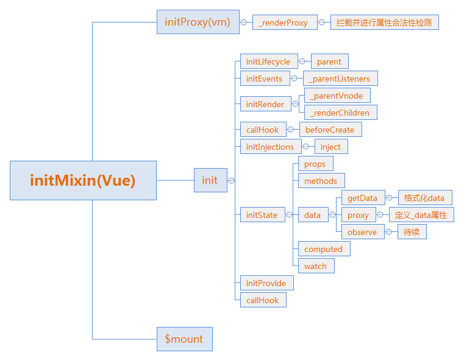

# 源码起步2

上一节把mergeOptions函数弄完了，最后返回一个options赋给了vm.$options。
这一节继续跑代码：
```js
function initMixin (Vue) {
  Vue.prototype._init = function (options) {
    // ..上一节
    // 从这里开始跑
    /* istanbul ignore else */
    {
      initProxy(vm);
    }
    // expose real self
    vm._self = vm;
    initLifecycle(vm);
    initEvents(vm);
    initRender(vm);
    callHook(vm, 'beforeCreate');
    initInjections(vm); // resolve injections before data/props
    initState(vm);
    initProvide(vm); // resolve provide after data/props
    callHook(vm, 'created');

    /* istanbul ignore if */
    if ("development" !== 'production' && config.performance && mark) {
      vm._name = formatComponentName(vm, false);
      mark(endTag);
      measure(("vue " + (vm._name) + " init"), startTag, endTag);
    }

    if (vm.$options.el) {
      vm.$mount(vm.$options.el);
    }
  };
}
```
剩余的代码主要有3件事：initProxy()、各种初始化函数、挂载vue。

在讲initProxy()之前，有必要先讲讲这个奇怪的注释：/* istanbul ignore else */。

这个注释代码段出现的频率和"development" !== 'production'不相上下，一开始我是无视的，但是慢慢的觉得很奇怪，这个注释可能并不简单。

首先百度了一下istanbul，发现了这其实是一个代码覆盖率工具，即是否所有代码都测试到了。

这个工具我就不介绍了，总之这行注释的意思就是，下一个代码段中的else语句不计入代码覆盖率计算。

## initProxy()
开始跑initProxy()函数，只接受一个参数，即当前vue实例。
```js
// Line 1926
initProxy = function initProxy (vm) {
    // 是否支持es6的代理
    if (hasProxy) {
      // d根据参数判断调用哪一个代理
      var options = vm.$options;
      var handlers = options.render && options.render._withStripped
        ? getHandler
        : hasHandler;
      vm._renderProxy = new Proxy(vm, handlers);
    } else {
      vm._renderProxy = vm;
    }
  };
```
首先会判断是否支持Proxy，这是ES6新出的语法代理，详情可见阮一峰的书:http://es6.ruanyifeng.com/#docs/proxy。

若支持，再进行传进来的vm进行参数判断，选择代理。

当前 vm 只有三个参数（其实不止，先不管了）：$options、_isVue、_uid，所以很明显，调用的是hasHandelr这个代理。
```js
// Line 1866
var initProxy;
{
  // ..一些字符集

  var hasProxy =
    typeof Proxy !== 'undefined' &&
    Proxy.toString().match(/native code/);

  if (hasProxy) {
    var isBuiltInModifier = makeMap('stop,prevent,self,ctrl,shift,alt,meta,exact');
    config.keyCodes = new Proxy(config.keyCodes, {
      set: function set (target, key, value) {
        // ..定义事件别名
      }
    });
  }

  var hasHandler = {
    has: function has (target, key) {
      var has = key in target;
      // 判断key是否跟内置全局变量冲突
      var isAllowed = allowedGlobals(key) || key.charAt(0) === '_';
      // 不存在或者非法
      if (!has && !isAllowed) {
        warnNonPresent(target, key);
      }
      return has || !isAllowed
    }
  };

  var getHandler = {
    //.. 先不管
  };

  initProxy = function initProxy (vm) {
    if (hasProxy) {
      // determine which proxy handler to use
      var options = vm.$options;
      var handlers = options.render && options.render._withStripped
        ? getHandler
        : hasHandler;
      vm._renderProxy = new Proxy(vm, handlers);
    } else {
      vm._renderProxy = vm;
    }
  };
}
```
initProxy(vm)这个函数主要就做了一个方法劫持，相当于ng里面的拦截器，在vm._renderProxy中，每一个键都会进行合法性检测，如果与内置全局对象冲突，就会调用warnNonPresent()报警。

## 初始化家族

这一部分包含8个初始化，个个都是怪物，然而由于案例比较简单，大部门都会直接跳过。

1. initLifecycle
```js
// Line 2596
function initLifecycle (vm) {
  var options = vm.$options;

  // 没有parent 跳
  var parent = options.parent;
  if (parent && !options.abstract) {
    while (parent.$options.abstract && parent.$parent) {
      parent = parent.$parent;
    }
    parent.$children.push(vm);
  }

  vm.$parent = parent;
  vm.$root = parent ? parent.$root : vm;

  vm.$children = [];
  vm.$refs = {};

  vm._watcher = null;
  vm._inactive = null;
  vm._directInactive = false;
  vm._isMounted = false;
  vm._isDestroyed = false;
  vm._isBeingDestroyed = false;
}
```

这个函数主要对vm.$options.parent属性进行处理，很遗憾，我没有。

目前，vm的属性是5个，多了_self、_renderProxy，跑完这个函数，又多了一串，暂时不管。
2. initEvents
```js
// Line 2389
function initEvents (vm) {
  vm._events = Object.create(null);
  vm._hasHookEvent = false;
  // 又搞parent 没有
  var listeners = vm.$options._parentListeners;
  if (listeners) {
    updateComponentListeners(vm, listeners);
  }
}
```
多了2个事件相关属性。
3. initRender
```js
// Line 
function initRender (vm) {
  vm._vnode = null; // the root of the child tree
  vm._staticTrees = null; // v-once cached trees
  var options = vm.$options;
  var parentVnode = vm.$vnode = options._parentVnode; // the placeholder node in parent tree
  var renderContext = parentVnode && parentVnode.context;
  // 由于传了2个undefined 返回一个空对象
  vm.$slots = resolveSlots(options._renderChildren, renderContext);
  vm.$scopedSlots = emptyObject;
  // 2个属性方法 之后再看
  vm._c = function (a, b, c, d) { return createElement(vm, a, b, c, d, false); };
  vm.$createElement = function (a, b, c, d) { return createElement(vm, a, b, c, d, true); };

  // $attrs & $listeners are exposed for easier HOC creation.
  // they need to be reactive so that HOCs using them are always updated
  var parentData = parentVnode && parentVnode.data;

  /* istanbul ignore else */
  {
    defineReactive(vm, '$attrs', parentData && parentData.attrs || emptyObject, function () {
      !isUpdatingChildComponent && warn("$attrs is readonly.", vm);
    }, true);
    defineReactive(vm, '$listeners', options._parentListeners || emptyObject, function () {
      !isUpdatingChildComponent && warn("$listeners is readonly.", vm);
    }, true);
  }
}
```
4. callHook
```js
// Line 2890
function callHook (vm, hook) {
  // hook => beforeCreate
  // 没有这个钩子函数
  var handlers = vm.$options[hook];
  if (handlers) {
    for (var i = 0, j = handlers.length; i < j; i++) {
      try {
        handlers[i].call(vm);
      } catch (e) {
        handleError(e, vm, (hook + " hook"));
      }
    }
  }
  // 这个也没有
  if (vm._hasHookEvent) {
    vm.$emit('hook:' + hook);
  }
}
```
钩子函数都没有，这个初始化跳过。
5. initInjections
```js
// Line 3595
function initInjections (vm) {
  // 由于没有inject属性 跳过
  var result = resolveInject(vm.$options.inject, vm);
  if (result) {
    observerState.shouldConvert = false;
    Object.keys(result).forEach(function (key) {
      /* istanbul ignore else */
      {
        defineReactive(vm, key, result[key], function () {
          warn(
            "Avoid mutating an injected value directly since the changes will be " +
            "overwritten whenever the provided component re-renders. " +
            "injection being mutated: \"" + key + "\"",
            vm
          );
        });
      }
    });
    observerState.shouldConvert = true;
  }
}
```
6. initState
```js
// Line 
function initState (vm) {
  vm._watchers = [];
  var opts = vm.$options;
  // 针对参数做初始化
  if (opts.props) { initProps(vm, opts.props); }
  if (opts.methods) { initMethods(vm, opts.methods); }
  // 目前只有data参数
  if (opts.data) {
    initData(vm);
  } else {
    observe(vm._data = {}, true /* asRootData */);
  }
  if (opts.computed) { initComputed(vm, opts.computed); }
  if (opts.watch && opts.watch !== nativeWatch) {
    initWatch(vm, opts.watch);
  }
}
```

这个地方开始对传进来的参数做初始化挂载，由于只传了el和data，而el参数在最后面才处理，所以目前只会执行initData函数。

来看看initData函数运作，这可能是最关键的部分了。
```js
// Line 3338
function initData (vm) {
  // 取出data参数 这里的data不是传进来的data对象 而是一个函数
  var data = vm.$options.data;
  data = vm._data = typeof data === 'function'
    ? getData(data, vm)
    : data || {};
  // data属性必须返回对象
  if (!isPlainObject(data)) {
    data = {};
    "development" !== 'production' && warn(
      'data functions should return an object:\n' +
      'https://vuejs.org/v2/guide/components.html#data-Must-Be-a-Function',
      vm
    );
  }
  // 代理data属性
  var keys = Object.keys(data);
  var props = vm.$options.props;
  var methods = vm.$options.methods;
  var i = keys.length;
  while (i--) {
    var key = keys[i];
    {
      if (methods && hasOwn(methods, key)) {
        warn(
          ("Method \"" + key + "\" has already been defined as a data property."),
          vm
        );
      }
    }
    if (props && hasOwn(props, key)) {
      "development" !== 'production' && warn(
        "The data property \"" + key + "\" is already declared as a prop. " +
        "Use prop default value instead.",
        vm
      );
    } else if (!isReserved(key)) {
        // 禁止以$,_开头
      proxy(vm, "_data", key);
    }
  }
  // 双绑入口
  observe(data, true /* asRootData */);
}
```
整理一下，data属性初始化主要有格式化、代理、双绑三个部分。

首先来看看格式化，在第一节中的`mergeOptions`函数最后面，`options`中的`data`属性变成了一个叫`mergedInstanceDataFn`的函数，因此三元表示式返回的是`getData(data, vm)`。

`getData`函数比较简单， 所以把两个弄一起得了。

```js
// Line 3380
function getData (data, vm) {
  try {
    return data.call(vm, vm)
  } catch (e) {
    handleError(e, vm, "data()");
    return {}
  }
}
// Line 1164
// 传进来的parentVal、childVal分别为undefined、{message:'Hello Vue!} 
function mergedInstanceDataFn () {
  // instance merge
  var instanceData = typeof childVal === 'function'
    ? childVal.call(vm, vm)
    : childVal;
  var defaultData = typeof parentVal === 'function'
    ? parentVal.call(vm, vm)
    : parentVal;
  // 合并数据 由于第二个参数为undefined 直接返回原data对象
  if (instanceData) {
    return mergeData(instanceData, defaultData)
  } else {
    return defaultData
  }
    }
```

在 `getData` 函数中，会尝试以 vm 为上下文执行 `data` 函数，根据参数执行`mergedInstanceDataFn` 函数后，最后返回的仍然是传进来的 `data` 对象。

再来看代理部分，首先会遍历data对象的键，判断是否不以$, _开头，然后进行代理操作。尝试了一下，如果使用 $message,_message会报错，后面再看为什么。

这部分的关键在于proxy这个函数，ES6自带的是Proxy，不是一个东西，是一个正常的函数。

```js
// Line 3259
var sharedPropertyDefinition = {
  enumerable: true,
  configurable: true,
  get: noop,
  set: noop
};

function proxy (target, sourceKey, key) {
  sharedPropertyDefinition.get = function proxyGetter () {
    return this[sourceKey][key]
  };
  sharedPropertyDefinition.set = function proxySetter (val) {
    this[sourceKey][key] = val;
  };
  Object.defineProperty(target, key, sharedPropertyDefinition);
}
```

简单来讲，这个方法就是给 vm 添加了一个_data属性，值是data。

第三部分属于比较核心的部分，即数据监测，双绑的一部分，下次写吧！

用一张图片梳理一下第二节吧。

