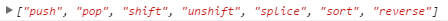

# Vue之数据劫持

上一节讲到 `initData` 函数，其中包含格式化、代理、监听。

```js
function initData(vm) {
    var data = vm.$options.data;
    //data = vm._data = ... 格式化data
    // ...proxy(vm, "_data", keys[i]); 代理
    // 监听
    observe(data, true /* asRootData */ );
}
```

这一节重点开始跑`observe`函数，该函数接受2个参数，一个是数据，一个布尔值，代表是否是顶层根数据。
```js
// Line 939
function observe (value, asRootData) {
  if (!isObject(value) || value instanceof VNode) {
    return
  }
  var ob;
  // 判断是否有__ob__属性 即是否已被监听
  if (hasOwn(value, '__ob__') && value.__ob__ instanceof Observer) {
    ob = value.__ob__;
  } else if (
    observerState.shouldConvert && // 是否应该被监听 默认为true
    !isServerRendering() && // 是否是服务器渲染
    (Array.isArray(value) || isPlainObject(value)) && // 数据必须为数组或对象
    Object.isExtensible(value) && // 是否可扩展 => 能添加新属性
    !value._isVue // vue实例才有的属性
  ) {
    ob = new Observer(value); // 生成一个观察者
  }
  if (asRootData && ob) {
    ob.vmCount++;
  }
  return ob
}
```

observe函数除去大量的判断，关键部分就是new了一个观察者来进行数据监听，所以直接跳进该构造函数：

```js
// Line 873
var Observer = function Observer (value) {
  this.value = value;

  // 依赖收集
  this.dep = new Dep();
  this.vmCount = 0;
  // 通过Object.defineProperty定义__ob__属性 this指向Observer实例
  def(value, '__ob__', this);
  if (Array.isArray(value)) {
    var augment = hasProto
      ? protoAugment
      : copyAugment;
    augment(value, arrayMethods, arrayKeys);
    this.observeArray(value);
  } else {
    this.walk(value);
  }
};
```

这个构造函数给实例绑了3个属性，分别为data对象的value、记数用的vmCount、依赖dep，接着根据数据类型调用不同的遍历方法进行依赖收集。　　

Dep对象比较简单，包含2个属性和4个对应的原型方法，如下：
```js
// Line 667
var Dep = function Dep () {
  this.id = uid++;
  this.subs = [];
};

Dep.prototype.addSub = function addSub (sub) {
  this.subs.push(sub);
};

Dep.prototype.removeSub = function removeSub (sub) {
  remove(this.subs, sub);
};

Dep.prototype.depend = function depend () {
  if (Dep.target) {
    Dep.target.addDep(this);
  }
};

Dep.prototype.notify = function notify () {
  // stabilize the subscriber list first
  var subs = this.subs.slice();
  for (var i = 0, l = subs.length; i < l; i++) {
    subs[i].update();
  }
};
```
- new出来的dep实例只有2个属性，一个是每次+1的计数uid，还有一个是依赖收集数组。
- 原型上的4个方法分别对应增、删、添加依赖、广播，由于暂时用不到update函数，所以先放着。
- 用自定义的def方法把__ob__属性绑到了生成的observe实例上，该属性引用了自身。
- 根据value是类型是数组还是对象，调用不同的方法进行处理。案例中传进来的value是一个object，所以会跳到walk方法中。

这里不妨看看如果是数组会怎样。其中，根据环境是否支持__proto__分别调用`protoAugment`或`copyAugment`，这两个方法比较简单，上代码就能明白。
```js
// Line 916
function protoAugment (target, src, keys) {
  /* eslint-disable no-proto */
  target.__proto__ = src;
  /* eslint-enable no-proto */
}
function copyAugment (target, src, keys) {
  for (var i = 0, l = keys.length; i < l; i++) {
    // 遍历keys
    // 调用def(tar,key,value) => (tar[key] = (value => src[key]))
    var key = keys[i];
    def(target, key, src[key]);
  }
}
```

选择了对应的方法就开始调用，传进的参数除了value还是两个奇怪的值：arrayMethods、arrayKeys。
```js
// Line 819
var arrayProto = Array.prototype;
var arrayMethods = Object.create(arrayProto);

var arrayKeys = Object.getOwnPropertyNames(arrayMethods);
```

简单来讲，arrayMethods就是一个对象，拥有数组的方法但不是数组。

Object.getOwnPropertyNames方法以数组形式返回对象所有可枚举与不可枚举方法，所以arrayKeys直接在控制台打印可以看到：

最后，不管选择哪个方法，都会将“改造过”的数组方法添加到value对象上，由于代码跑不到，等下次给出具体值吧。这里接着会调用`observeArray`方法，将数组value穿进去。

```js
// Line 904
 Observer.prototype.observeArray = function observeArray (items) {
    // 遍历分别调用observe方法
  for (var i = 0, l = items.length; i < l; i++) {
    observe(items[i]);
  }
};
```
绕了一圈，最后还是遍历value，挨个调用observe方法，并指向了walk方法。
```js
// Line 894
Observer.prototype.walk = function walk (obj) {
  var keys = Object.keys(obj);
  for (var i = 0; i < keys.length; i++) {
    defineReactive(obj, keys[i], obj[keys[i]]);
  }
};
```
这个方法比较简单，获取传进来的对象键，遍历后调用`defineReactive`方法，这是响应式的核心函数，双绑爸爸。

下节再来说这个，完结完结！　

补充tips：

　之前有一段代码，我说将改造过的数组方法添加到数组value上，这个改造是什么意思呢？其实关于arrayMethods代码没有全部贴出来，这里做简单的解释。
```js
// Line 818
var arrayProto = Array.prototype;
var arrayMethods = Object.create(arrayProto);
// 以下数组方法均会造成破坏性操作
[
  'push',
  'pop',
  'shift',
  'unshift',
  'splice',
  'sort',
  'reverse'
].forEach(function (method) {
  // 缓存原生方法
  var original = arrayProto[method];
  def(arrayMethods, method, function mutator () {
    // 将argument转换为真数组
    var args = [], len = arguments.length;
    while ( len-- ) args[ len ] = arguments[ len ];

    // 首先执行原生方法
    var result = original.apply(this, args);
    var ob = this.__ob__;
    var inserted;
    // 值添加方法
    // push和unshift会添加一个值 即args
    // splice(a,b,c,..)方法只有c后面是添加的值 所以用slice排除前两个参数
    switch (method) {
      case 'push':
      case 'unshift':
        inserted = args;
        break
      case 'splice':
        inserted = args.slice(2);
        break
    }
    // 对添加的值调用数组监听方法
    if (inserted) { ob.observeArray(inserted); }
    // 广播变化 提示DOM更新及其他操作
    ob.dep.notify();
    return result
  });
});
```
完整的arrayMethods如上所述，解释大部分都写出来了，这也是vue通过对数组方法的劫持来达到变化监听的原理，对象的劫持下节再来分析。
惯例，来一张图：

!()[./img/数据劫持.png]