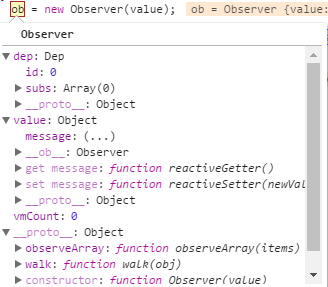
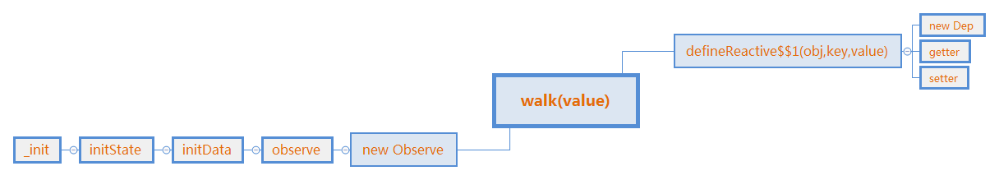

# Vue 数据劫持2

vue通过数据劫持来达到监听和操作DOM更新，上一节简述了数组变化是如何监听的，这一节先讲讲对象属性是如何劫持的。
```js
Observer.prototype.walk = function walk (obj) {
  var keys = Object.keys(obj);
  for (var i = 0; i < keys.length; i++) {
    defineReactive(obj, keys[i], obj[keys[i]]);
  }
};
```

上一节说到这里，现在进入`defineReactive`来看看具体的劫持过程

```js
// Line 964
function defineReactive (obj, key, val, customSetter, shallow) {
  // 生成一个依赖管理
  var dep = new Dep();
  // getOwnPropertyDescriptor方法以对象形式返回键描述信息
  // 包括enumerable、writable等等
  var property = Object.getOwnPropertyDescriptor(obj, key);
  if (property && property.configurable === false) {
    return
  }

  // cater for pre-defined getter/setters
  var getter = property && property.get;
  var setter = property && property.set;
  // 值为对象时的嵌套监听 
  // 当前值为'Hello Vue'的字符串 直接返回
  var childOb = !shallow && observe(val);
  Object.defineProperty(obj, key, {
    enumerable: true,
    configurable: true,
    get: function reactiveGetter () {
      var value = getter ? getter.call(obj) : val;
      if (Dep.target) {
        dep.depend();
        if (childOb) {
          childOb.dep.depend();
          if (Array.isArray(value)) {
            dependArray(value);
          }
        }
      }
      return value
    },
    set: function reactiveSetter (newVal) {
      var value = getter ? getter.call(obj) : val;
      /* eslint-disable no-self-compare */
      if (newVal === value || (newVal !== newVal && value !== value)) {
        return
      }
      /* eslint-enable no-self-compare */
      if ("development" !== 'production' && customSetter) {
        customSetter();
      }
      if (setter) {
        setter.call(obj, newVal);
      } else {
        val = newVal;
      }
      childOb = !shallow && observe(newVal);
      dep.notify();
    }
  });
}
```
由于value只有一个message键，所以一次就结束了，函数疯狂返回，然后回到了observe的构造函数：
```js
function observe (value, asRootData) {
  if (!isObject(value) || value instanceof VNode) {
    return
  }
  var ob;
  if (hasOwn(value, '__ob__') && value.__ob__ instanceof Observer) {
    ob = value.__ob__;
  } else if (
    observerState.shouldConvert &&
    !isServerRendering() &&
    (Array.isArray(value) || isPlainObject(value)) &&
    Object.isExtensible(value) &&
    !value._isVue
  ) {
    // 执行到这里
    ob = new Observer(value);
  }
  if (asRootData && ob) {
    ob.vmCount++;
  }
  return ob
}
```

来看看搞了这么久，ob是个什么东西：



dep是依赖收集数据，包含计数id和依赖数组subs，还有4个原型方法。

value是被监听数据，除了数据本身，还添加了__ob__属性引用自身，自定义了get和set方法，计数的vmCount。

原型方法包含一个遍历数组数据的observeArray与监听对象的walk方法。

接下来的代码将vmCount加1，然后返回这个ob对象，返回到了initData函数：
```js
function initData(vm) {
    // ..格式化、代理
    // ...
    // 监听数据
    observe(data, true /* asRootData */ );
}
```

这个函数也到头了，返回到了initState函数：
```js
function initState (vm) {
  // ..从这里跳出来
  if (opts.data) {
    initData(vm);
  } else {
    observe(vm._data = {}, true /* asRootData */);
  }
  // 下面2个参数没有，不执行
  if (opts.computed) { initComputed(vm, opts.computed); }
  if (opts.watch && opts.watch !== nativeWatch) {
    initWatch(vm, opts.watch);
  }
}
```

好吧，这个也没啥执行的，返回到了最原始的_init初始化函数：
```js
Vue.prototype._init = function(options) {
    // ...各种初始化
    // ... 
    // 从这里跳出来
    initState(vm);
    initProvide(vm); // resolve provide after data/props
    callHook(vm, 'created');

    /* istanbul ignore if */
    if ("development" !== 'production' && config.performance && mark) {
        vm._name = formatComponentName(vm, false);
        mark(endTag);
        measure(((vm._name) + " init"), startTag, endTag);
    }

    if (vm.$options.el) {
        vm.$mount(vm.$options.el);
    }
};
```

接下来是initProvide函数，provide翻译成中文是准备的意思。
```js
// Line 3586
function initProvide (vm) {
    // 没有这个属性 跳
  var provide = vm.$options.provide;
  if (provide) {
    vm._provided = typeof provide === 'function'
      ? provide.call(vm)
      : provide;
  }
}
```
然后调用钩子函数，进入created阶段，由于没有定义执行内容，所以直接跳出来，代码就不贴了。

那个dev内容也不太清楚记录的什么，暂时先不管，下面是双绑的另一个大模块：AST。本节先简单结束了，数据劫持也差不多这些，下一节开始跑节点挂载。

上图：


