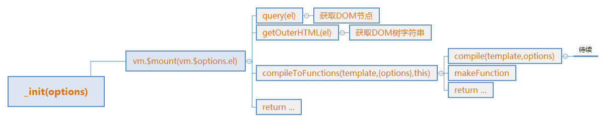

# Vue AST(1)

讲完了数据劫持原理和一堆初始化 现在是DOM相关的代码了

上一节是从这个函数开始的：
```js
Vue.prototype._init = function(options) {
    // 大量初始化
    // ...
    // Go!
    if (vm.$options.el) {
        vm.$mount(vm.$options.el);
    }
};
```

弄完data属性的数据绑定后，开始处理el属性，也就是挂载的DOM节点，这里的vm.$options.el也就是传进去的'#app'字符串。

有一个值得注意的点是，源码中有2个$mount函数都是Vue$3的原型函数，其中一个标记了注释public mount method，在8411行，另外一个在10712行。打断点进入的是后面，因为定义的晚，覆盖了前面的函数。

这里首先定义了原型方法$mount，然后将其赋给了一个变量mount，然后重新定义此方法，所以调用mount.call会调用第一次定义的$mount，vue原型上最终只有第二次定义的$mount
```js
// Line 8410
// public mount method
Vue$3.prototype.$mount = function (
  el,
  hydrating
) {
  el = el && inBrowser ? query(el) : undefined;
  return mountComponent(this, el, hydrating)
};
// ...

// Line 10771
var mount = Vue$3.prototype.$mount;
Vue$3.prototype.$mount = function (el, hydrating) {
   // 将el格式化为DOM节点
   el = el && query(el);
  // 判断是否挂载到body或者html标签上
  /* istanbul ignore if */
  if (el === document.body || el === document.documentElement) {
    "development" !== 'production' && warn(
      "Do not mount Vue to <html> or <body> - mount to normal elements instead."
    );
    return this
  }

  var options = this.$options;
  // 处理template/el 转换为渲染函数
  if (!options.render) {
    //..
  }
  return mount.call(this, el, hydrating)
};
```

现在进入后面的$mount函数看看内部结构,代码前半段首先将el转换为DOM节点，并判断是否挂载到body或者html标签，看看简单的query函数：
```js
// Line 5206
function query (el) {
  if (typeof el === 'string') {
    var selected = document.querySelector(el);
    if (!selected) {
      "development" !== 'production' && warn(
        'Cannot find element: ' + el
      );
      return document.createElement('div')
    }
    return selected
  } else {
    return el
  }
}
```

函数比较简单，值得注意的一个点是，由于调用的是querySelector方法，所以可以传标签名、类名、C3新选择器等，都会返回查询到的第一个。当然，总是传一个ID或者确定的DOM节点才是正确用法。

下面看接下来的代码：
```js
Vue$3.prototype.$mount = function (el, hydrating) {
  //...
  // ..没有render属性 进入代码段
  if (!options.render) {
    var template = options.template;
    // 没有template 跳
    if (template) {
      //...
    }
     // 有el 获取字符串化的DOM树
     else if (el) {
      template = getOuterHTML(el);
    }
    
    if (template) {
      //...
    }
  }
  return mount.call(this, el, hydrating)
};
```

由于没有template属性，会直接进入第二个判断条件，调用getOuterHTML来初始化template变量，函数比较简单， 来看看：
```js
// Line 10784
function getOuterHTML (el) {
  if (el.outerHTML) {
    return el.outerHTML
  } 
  // 兼容IE中的SVG
  else {
    var container = document.createElement('div');
    container.appendChild(el.cloneNode(true));
    return container.innerHTML
  }
}
```

简单来讲，就是调用 `getOuterHTML` 返回DOM树的字符串形式，看图就明白了：
下面看最后一段代码：
```js
Vue$3.prototype.$mount = function (el, hydrating) {
  //...
  // ..没有render属性 进入代码段
  if (!options.render) {
    // 处理tempate
    // ...
    if (template) {
      /* istanbul ignore if */
      if ("development" !== 'production' && config.performance && mark) {
        mark('compile');
      }

      // 将DOM树字符串编译为函数
      var ref = compileToFunctions(template, {
        shouldDecodeNewlines: shouldDecodeNewlines,
        shouldDecodeNewlinesForHref: shouldDecodeNewlinesForHref,
        delimiters: options.delimiters,
        comments: options.comments
      }, this);
      // options添加属性
      var render = ref.render;
      var staticRenderFns = ref.staticRenderFns;
      options.render = render;
      options.staticRenderFns = staticRenderFns;

      /* istanbul ignore if */
      if ("development" !== 'production' && config.performance && mark) {
        mark('compile end');
        measure(("vue " + (this._name) + " compile"), 'compile', 'compile end');
      }
    }
  }
  return mount.call(this, el, hydrating)
};
```

忽略2段dev模式下的提示代码，剩下的代码做了3件事，调用compileToFunctions函数肢解DOM树字符串，将返回的对象属性添加到options上，再次调用mount函数。

首先看一下`compileToFunctions`函数，该函数接受3个参数，分别为字符串、配置对象、当前vue实例。

由于函数比较长，而且部分是错误判断，简化后如下：
```js
function compileToFunctions (template,  options,  vm) {
    // 1 获取参数
    options = extend({}, options);
    // ...

    // check cache
    var key = options.delimiters
      ? String(options.delimiters) + template
      : template;
    if (cache[key]) {
      return cache[key]
    }

    // 2
    var compiled = compile(template, options);
    // ...
    // 3
    var res = {};
    var fnGenErrors = [];
    res.render = createFunction(compiled.render, fnGenErrors);
    res.staticRenderFns = compiled.staticRenderFns.map(function (code) {
      return createFunction(code, fnGenErrors)
    });

    // ...

    // 4
    return (cache[key] = res)
  }
```
可以看到，这个函数流程可以分为4步，获取参数 => 调用compile函数进行编译 => 将得到的compiled转换为函数 => 返回并缓存。

第一节现在这样吧。一张图总结下：



