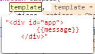

# Vue AST(2)

上一节获取到了DOM树的字符串，准备进入compile阶段：
```js
    function compileToFunctions(template,options,vm) {
        // 获取配置参数
        options = options || {};

        // ...

        // Go!
        var compiled = compile(template, options);

        // ...
    }
```

该函数接受两个参数，DOM树字符串、配置参数，如图


```js
// Line 10615 
    function compile (template, options) {
      var finalOptions = Object.create(baseOptions);
      var errors = [];
      var tips = [];
      finalOptions.warn = function (msg, tip) {
        (tip ? tips : errors).push(msg);
      };
      // 合并参数
      if (options) {
        if (options.modules) {
          finalOptions.modules =
            (baseOptions.modules || []).concat(options.modules);
        }
        if (options.directives) {
          finalOptions.directives = extend(
            Object.create(baseOptions.directives || null),
            options.directives
          );
        }
        for (var key in options) {
          if (key !== 'modules' && key !== 'directives') {
            finalOptions[key] = options[key];
          }
        }
      }
      // 核心编译函数
      var compiled = baseCompile(template, finalOptions);
      {
        errors.push.apply(errors, detectErrors(compiled.ast));
      }
      // 提示与报错属性添加
      compiled.errors = errors;
      compiled.tips = tips;
      return compiled
    }
```
compile主要做了3件事：

1. 参数合并

这里涉及到`baseOptions`与传进来的`options`，`baseOptions`是内置对象，与`options`合并后得到`finalOptions`作为参数传进第二步的函数。
```js
// Line 9670
var baseOptions = {
  expectHTML: true,
  modules: modules$1,
  directives: directives$1,
  isPreTag: isPreTag,
  isUnaryTag: isUnaryTag,
  mustUseProp: mustUseProp,
  canBeLeftOpenTag: canBeLeftOpenTag,
  isReservedTag: isReservedTag,
  getTagNamespace: getTagNamespace,
  staticKeys: genStaticKeys(modules$1)
};
```
2. 调用baseCompile函数

该函数接受2个参数：字符串、参数对象。
```js
// Line 10668
function baseCompile (template, options) {
    // 解析字符串为 AST
  var ast = parse(template.trim(), options);
  if (options.optimize !== false) {
    optimize(ast, options);
  }
  var code = generate(ast, options);
  return {
    ast: ast,
    render: code.render,
    staticRenderFns: code.staticRenderFns
  }
}
```
3. 添加提示、报错属性并返回`compiled`值

将过程中出现的`error`与`tips`作为属性添加到`compiled`对象上，以便一次性输出。

跑流程的话，主要还是看第二步，理一理DOM树字符串是如何被解析和编译的，来看`parse`这个函数吧！　

这函数太长了，分两部分来：　
```js
// Line 8964
function parse (template, options) {
  // 参数修正
  warn$2 = options.warn || baseWarn;
  // 这几个属性都是原型链上面的
  platformIsPreTag = options.isPreTag || no;
  platformMustUseProp = options.mustUseProp || no;
  platformGetTagNamespace = options.getTagNamespace || no;

  transforms = pluckModuleFunction(options.modules, 'transformNode');
  preTransforms = pluckModuleFunction(options.modules, 'preTransformNode');
  postTransforms = pluckModuleFunction(options.modules, 'postTransformNode');
  // 这是自家的 值为undefined…
  delimiters = options.delimiters;

  var stack = [];
  var preserveWhitespace = options.preserveWhitespace !== false;
  var root;
  var currentParent;
  var inVPre = false;
  var inPre = false;
  var warned = false;

  function warnOnce (msg) {
    if (!warned) {
      warned = true;
      warn$2(msg);
    }
  }

  function closeElement (element) {
    if (element.pre) {
      inVPre = false;
    }
    if (platformIsPreTag(element.tag)) {
      inPre = false;
    }
    for (var i = 0; i < postTransforms.length; i++) {
      postTransforms[i](element, options);
    }
  }

  parseHTML(/*...*/);
  return root
}

```
首先是获取options参数的属性，其中大部分都是定义在原型上，即baseOptions，所以没什么讲的。唯一涉及的函数就是`pluckModuleFunction`，比较简单，看一下内容：
```js
// Line 6434
function pluckModuleFunction (modules, key) {
    // 返回modules[key]组成的数组
  return modules
    ? modules.map(function (m) { return m[key]; }).filter(function (_) { return _; })
    : []
}
```

简而言之，就是返回一个数组，内容是modules[key]，这里返回空数组。

第一部分没什么讲的，主要是声明一些变量，第二部分才是核心：
```js
function parse (template, options) {
  // ..part-1

  parseHTML(template, {
    warn: warn$2,
    expectHTML: options.expectHTML, // 默认TRUE
    isUnaryTag: options.isUnaryTag,
    canBeLeftOpenTag: options.canBeLeftOpenTag,
    shouldDecodeNewlines: options.shouldDecodeNewlines,
    shouldDecodeNewlinesForHref: options.shouldDecodeNewlinesForHref,
    shouldKeepComment: options.comments,
    start: function start (tag, attrs, unary) {/*...*/},

    end: function end () {/*...*/},

    chars: function chars (text) {/*...*/ },
    comment: function comment (text) {
      currentParent.children.push({
        type: 3,
        text: text,
        isComment: true
      });
    }
  });
  return root
}
```

这部分就是巨大的函数调用，第一个参数为DOM字符串，第二个参数是一个对象，包含多个属性与方法，属性内容如下：

```js
// Line 8592
// 自闭合标签
var isUnaryTag = makeMap(
  'area,base,br,col,embed,frame,hr,img,input,isindex,keygen,' +
  'link,meta,param,source,track,wbr'
);
// 可以省略闭合标签
var canBeLeftOpenTag = makeMap(
  'colgroup,dd,dt,li,options,p,td,tfoot,th,thead,tr,source'
);
 // 当前浏览器是否会对换行转义,IE 会对属性值中的换行符进行编码，其他浏览器不会
var shouldDecodeNewlines = inBrowser ? getShouldDecode(false) : false;
var shouldDecodeNewlinesForHref = inBrowser ? getShouldDecode(true) : false;

//检查当前浏览器是否对属性值中的char进行编码
function getShouldDecode (href) {
  div = div || document.createElement('div');
  div.innerHTML = href ? "<a href=\"\n\"/>" : "<div a=\"\n\"/>";
  return div.innerHTML.indexOf('&#10;') > 0
}
```

剩余三个方法包括start、end、chars，单独讲不好讲，在parseHTML方法边跑边说。
暂时结束，parseHTML方法非常长，单独讲。

