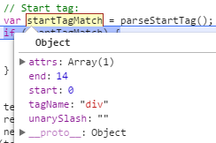
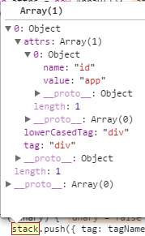

# Vue AST(3)

上一节到了parseHTML函数，该函数接受一个字符串与一个对象，字符串即对应的DOM，对象包含几个字符串匹配集及3个长函数。

简略梳理部分函数代码如下：

```js
// Line-7672
    function parseHTML(html, options) {
        var stack = [];
        var expectHTML = options.expectHTML;
        var isUnaryTag$$1 = options.isUnaryTag || no;
        var canBeLeftOpenTag$$1 = options.canBeLeftOpenTag || no;
        var index = 0;
        var last, lastTag;
        while (html) {
            last = html;
            // 排除script,style,textarea三个标签
            if (!lastTag || !isPlainTextElement(lastTag)) {
                var textEnd = html.indexOf('<');
                if (textEnd === 0) {
                    // 截取注释 var comment = /^<!--/;
                    if (comment.test(html)) {
                        var commentEnd = html.indexOf('-->');

                        if (commentEnd >= 0) {
                            advance(commentEnd + 3);
                            continue
                        }
                    }
                    // 处理向下兼容的注释 比如说<!--[if lt IE 9]>
                    if (conditionalComment.test(html)) {
                        var conditionalEnd = html.indexOf(']>');

                        if (conditionalEnd >= 0) {
                            advance(conditionalEnd + 2);
                            continue
                        }
                    }
                    // Doctype:
                    var doctypeMatch = html.match(doctype);
                    if (doctypeMatch) {
                        advance(doctypeMatch[0].length);
                        continue
                    }
                    // End tag:
                    var endTagMatch = html.match(endTag);
                    if (endTagMatch) {
                        var curIndex = index;
                        advance(endTagMatch[0].length);
                        parseEndTag(endTagMatch[1], curIndex, index);
                        continue
                    }
                    // Start tag:
                    // 匹配起始标签
                    var startTagMatch = parseStartTag();
                    if (startTagMatch) {
                        handleStartTag(startTagMatch);
                        continue
                    }
                }
                // 初始化为undefined 这样安全且字符数少一点
                var text = (void 0),
                    rest$1 = (void 0),
                    next = (void 0);
                if (textEnd >= 0) {
                    rest$1 = html.slice(textEnd);
                    while (!endTag.test(rest$1) &&
                        !startTagOpen.test(rest$1) &&
                        !comment.test(rest$1) &&
                        !conditionalComment.test(rest$1)
                    ) {
                        // 处理文本中的<字符
                        next = rest$1.indexOf('<', 1);
                        if (next < 0) {
                            break
                        }
                        textEnd += next;
                        rest$1 = html.slice(textEnd);
                    }
                    text = html.substring(0, textEnd);
                    advance(textEnd);
                }

                if (textEnd < 0) {
                    text = html;
                    html = '';
                }

                if (options.chars && text) {
                    options.chars(text);
                }
            } else {
                /* code... */
            }

            if (html === last) {
                /* code... */
            }
        }
        // Clean up any remaining tags
        parseEndTag();

        function advance(n) {
            /* code... */
        }

        function parseStartTag() {
            /* code... */
        }

        function handleStartTag(match) {
            /* code... */
        }

        function parseEndTag(tagName, start, end) {
            /* code... */
        }
    }
```

函数比较长，除去开头的参数获取，后面直接用while循环开始对字符串进行切割。

在判断标签不是script,style,textarea三个特殊标签后，当字符串以<开头时，以注释、向下兼容注释、Doctype、结束标签、起始标签的顺序依次切割。

    由于案例中字符串是以<div开头，所以直接跳到起始标签的匹配：

```js
  function parseStartTag () {
    var start = html.match(startTagOpen);
    if (start) {
      var match = {
        tagName: start[1],// 标签名(div)
        attrs: [],
        start: index
      };
      advance(start[0].length); // html 字符串中去掉了'<div'
      var end, attr;
      // 进行属性的正则匹配
      // startTagClose 匹配/>或>
      // attribute 匹配属性 正则太长 没法讲
      // 本例中 attr 匹配后 => ['id=app','id','=','app']
      while (!(end = html.match(startTagClose)) && (attr = html.match(attribute))) {
        advance(attr[0].length); // html 字符串中去掉了 ' id="app"'
        // 属性加入
        match.attrs.push(attr);
      }
      // 在第二次while循环后 end匹配到结束标签 => ['>','']
      if (end) {
        match.unarySlash = end[1];
        advance(end[0].length); // html 字符串中去掉了 '>'
        // 标记结束位置
        match.end = index;
        return match
      }
    }
  }

// Line-8792
// 该函数将函数局部变量index往前推 并切割字符串
function advance(n) {
    index += n;
    html = html.substring(n);
}
```

可以看到，通过起始标签的匹配，字符串的`<div id='app'>`已经被切割出来，保存在一个对象中返回：



接下来，会调用 `handleStartTag` 方法再次处理返回的对象，看一下这个方法：

```js
//Line-8820
  function handleStartTag (match) {
    var tagName = match.tagName;
    var unarySlash = match.unarySlash;

    if (expectHTML) {
      if (lastTag === 'p' && isNonPhrasingTag(tagName)) {
        parseEndTag(lastTag);
      }
       // 可以省略闭合标签
      if (canBeLeftOpenTag$$1(tagName) && lastTag === tagName) {
        parseEndTag(tagName);
      }
    }
    // 自闭合标签
    var unary = isUnaryTag$$1(tagName) || !!unarySlash;
    // 记录属性个数 目前只有一个id属性
    var l = match.attrs.length;
    var attrs = new Array(l);
    for (var i = 0; i < l; i++) {
      var args = match.attrs[i];
      // // 一个bug 在对(.)?匹配时会出现
      if (IS_REGEX_CAPTURING_BROKEN && args[0].indexOf('""') === -1) {
        if (args[3] === '') { delete args[3]; }
        if (args[4] === '') { delete args[4]; }
        if (args[5] === '') { delete args[5]; }
      }
      // 匹配属性名app
      var value = args[3] || args[4] || args[5] || '';
      var shouldDecodeNewlines = tagName === 'a' && args[1] === 'href'
        ? options.shouldDecodeNewlinesForHref
        : options.shouldDecodeNewlines;
      attrs[i] = {
        name: args[1],
        // 处理转义字符
        value: decodeAttr(value, shouldDecodeNewlines)
      };
    }
    // 将切割出来的字符串转换为AST
    if (!unary) {
      stack.push({ tag: tagName, lowerCasedTag: tagName.toLowerCase(), attrs: attrs });
      lastTag = tagName;
    }

    if (options.start) {
      options.start(tagName, attrs, unary, match.start, match.end);
    }
// Line-8661
function decodeAttr (value, shouldDecodeNewlines) {
  var re = shouldDecodeNewlines ? encodedAttrWithNewLines : encodedAttr;
  return value.replace(re, function (match) { return decodingMap[match]; })
}
}
```

在该函数中，对之前的对象进行了二次处理，根据标签名、属性生成一个新对象，push到最开始的 stack 数组中，结果如图所示



由于匹配的是起始标签，所以也会以这个标签名结束，因此被标记为最后的结束标签，即前面一直是undefined的lastTag。

start方法只接受3个参数，这里传了5个，后面2个被忽略，参数情况是这样的:`start(tag,attrs,unary){tag='div', atts = [{name: "id", value: "app"}], unary = false}`

```js
    // Line-9017
    start: function start (tag, attrs, unary) {
      // 检查命名空间是否是svg或者math
      var ns = (currentParent && currentParent.ns) || platformGetTagNamespace(tag);

      // handle IE svg bug
      if (isIE && ns === 'svg') {
        attrs = guardIESVGBug(attrs);
      }

      var element = createASTElement(tag, attrs, currentParent);
      if (ns) {
        element.ns = ns;
      }
      // 检查tag属性是否是style、script
      if (isForbiddenTag(element) && !isServerRendering()) {
          /*warn ..*/
      }

      // apply pre-transforms
      for (var i = 0; i < preTransforms.length; i++) {
        element = preTransforms[i](element, options) || element;
      }

      if (!inVPre) {
        // 判断是否有v-pre属性
        processPre(element);
        if (element.pre) {
          inVPre = true;
        }
      }
      if (platformIsPreTag(element.tag)) {
        inPre = true;
      }
      // 分支跳转到else
      if (inVPre) {
        processRawAttrs(element);
      } else if (!element.processed) {
        // 处理v-for
        processFor(element);
         // 处理v-if
        processIf(element);
         // 处理v-once
        processOnce(element);
        // element-scope stuff
        processElement(element, options);
      }

      // 根元素不允许为slot或template 且不能有v-for属性
      // 总之必须为单一不可变的节点
      function checkRootConstraints (el) {
        {
          if (el.tag === 'slot' || el.tag === 'template') {
            /*warn ..*/
          }
          if (el.attrsMap.hasOwnProperty('v-for')) {
            /*warn ..*/
          }
        }
      }

      // tree management
      // 这个root是在parse函数开始的时候定义的
      if (!root) {
        root = element;
        checkRootConstraints(root);
      } else if (!stack.length) {
        // allow root elements with v-if, v-else-if and v-else
        if (root.if && (element.elseif || element.else)) {
          checkRootConstraints(element);
          addIfCondition(root, {
            exp: element.elseif,
            block: element
          });
        } else {
          warnOnce(
            "Component template should contain exactly one root element. " +
            "If you are using v-if on multiple elements, " +
            "use v-else-if to chain them instead."
          );
        }
      }
      // 没有父元素 跳过
      if (currentParent && !element.forbidden) {
        if (element.elseif || element.else) {
          processIfConditions(element, currentParent);
        } else if (element.slotScope) { // scoped slot
          currentParent.plain = false;
          var name = element.slotTarget || '"default"';(currentParent.scopedSlots || (currentParent.scopedSlots = {}))[name] = element;
        } else {
          currentParent.children.push(element);
          element.parent = currentParent;
        }
      }
      if (!unary) {
        currentParent = element;
        stack.push(element);
      } else {
        closeElement(element);
      }
    },
// Line-8946
function createASTElement (tag, attrs, parent) {
  return {
    type: 1,
    tag: tag,// div
    attrsList: attrs, // [{name:'id',value:'app'}]
    attrsMap: makeAttrsMap(attrs), //{id: "app"}
    parent: parent,// undefined
    children: []
  }
}
// Line-9214 
function processElement (element, options) {
  processKey(element);

  // 检测是否是空属性节点
  element.plain = !element.key && !element.attrsList.length;
  // 处理:ref或v-bind:ref属性
  processRef(element);
  // 当tag为slot时
  processSlot(element);
  // 处理:is或v-bind:is属性
  processComponent(element);
  // 处理class与style属性 包括原始的和通过:动态绑定
  for (var i = 0; i < transforms.length; i++) {
    element = transforms[i](element, options) || element;
  }
  // 处理属性
  processAttrs(element);
}
```

这个方法首先对标签名进行校验，然后再对属性进行更细致的处理，比如说v-pre,v-for,v-if等等，案例里没有，所以暂时不分析如何处理，下次再搞。

值得注意的是 transforms 这个数组，包含两个函数：transformNode与transformNode$1，其实只是对静态或动态绑定的class与style进行处理，代码如下：
```js
// Line-8494
function transformNode (el, options) {
  var warn = options.warn || baseWarn;
  var staticClass = getAndRemoveAttr(el, 'class');
  if ("development" !== 'production' && staticClass) {
    var res = parseText(staticClass, options.delimiters);
    if (res) {
      warn(
        "class=\"" + staticClass + "\": " +
        'Interpolation inside attributes has been removed. ' +
        'Use v-bind or the colon shorthand instead. For example, ' +
        'instead of <div class="{{ val }}">, use <div :class="val">.'
      );
    }
  }
  if (staticClass) {
    el.staticClass = JSON.stringify(staticClass);
  }
  var classBinding = getBindingAttr(el, 'class', false /* getStatic */);
  if (classBinding) {
    el.classBinding = classBinding;
  }
}

//Line-8356
function transformNode$1 (el, options) {
  var warn = options.warn || baseWarn;
  var staticStyle = getAndRemoveAttr(el, 'style');
  if (staticStyle) {
    /* istanbul ignore if */
    {
      var res = parseText(staticStyle, options.delimiters);
      if (res) {
        warn(
          "style=\"" + staticStyle + "\": " +
          'Interpolation inside attributes has been removed. ' +
          'Use v-bind or the colon shorthand instead. For example, ' +
          'instead of <div style="{{ val }}">, use <div :style="val">.'
        );
      }
    }
    el.staticStyle = JSON.stringify(parseStyleText(staticStyle));
  }

  var styleBinding = getBindingAttr(el, 'style', false /* getStatic */);
  if (styleBinding) {
    el.styleBinding = styleBinding;
  }
}
```